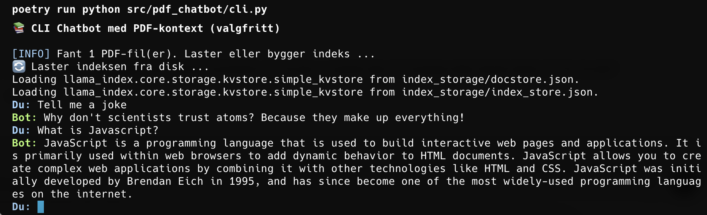

# PDF Chatbot med LlamaIndex, Flask og Ollama

Dette prosjektet er en enkel lokal chatbot som kan kjøres enten som webapp eller som kommandolinjeverktøy, og lar deg stille spørsmål til innholdet i dine egne PDF-filer. Den bruker `LlamaIndex` til å indeksere dokumenter, `Ollama` som LLM-backend, og `Flask` som webserver.

## Funksjoner

- Last inn og indekser egne PDF-filer
- Still spørsmål i en chat i et webgrensesnitt eller i kommandolinjen
- Få svar generert av en språkmodell (Dolphin-Mistral via Ollama)
- Sanntids-strømming av svaret til siden

## Teknologier

- **Python 3.10+**
- **Flask** – enkel backend og API
- **LlamaIndex** – for dokumentindeksering og spørringer
- **Ollama** – lokal kjøring av LLM (dolphin-mistral)
- **HuggingFace Embeddings** – for tekstvektorer
- **HTML/JS** – frontend med støtte for sanntidsstrømming

## Prosjektstruktur

```text
pdf-chatbot/
├── LICENSE
├── README.md
├── pyproject.toml         # Poetry konfigurasjon
├── poetry.lock            # Låst avhengigheter for poetry
├── .gitignore
└── src/
    └── pdf_chatbot/
        ├── __init__.py
        ├── app.py
        ├── cli.py
        ├── core.py
        ├── templates/
        │   └── index.html
        └── static/
            └── styles.css
        ├── pdf_folder/          # PDF-dokumenter for indeksering (opprettes automatisk ved behov)
        └── index_storage/      # Lagringsmappe for søkeindeksen (genereres automatisk)
```

## Kom i gang

### 1. Installer avhengigheter med Poetry

```bash
poetry install
```

### 2. Legg til PDF-filer

Plasser én eller flere PDF-filer i `pdf_folder/`.

### 3. (Alternativ 1) Kjør Flask-appen

```bash
poetry run python src/pdf_chatbot/app.py
```

Besøk http://localhost:5000 i nettleseren for å chatte med PDF-ene dine.

### 3. (Alternativ 2) Kjør CLI-appen

```bash
poetry run python src/pdf_chatbot/cli.py

# Avslutt
ctrl+C  # Alternativ 1
quit    # Alternativ 2
```

## Gjenoppbygging av indeks

Hvis du oppdaterer innholdet i `pdf_folder/`, slett mappen `index_storage/` for å bygge indeksen på nytt neste gang appen startes.

## Lisens

Dette prosjektet er lisensiert under [MIT-lisensen](LICENSE).

Laget med ❤️ og CPU-varme 🔥 for å forstå hvordan store språkmodeller (LLMs) fungerer!

## Skjermbilder

Skjermbilde av web-chatbotten i lys modus:


Skjermbilde av web-chatbotten i mørk modus:


Skjermbilde av web-chatbottens chat:


Skjermbilde av CLI-chatbottens chat:

